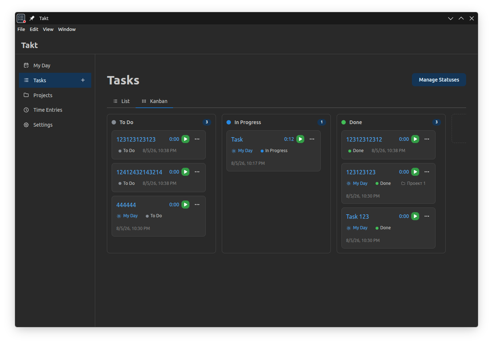
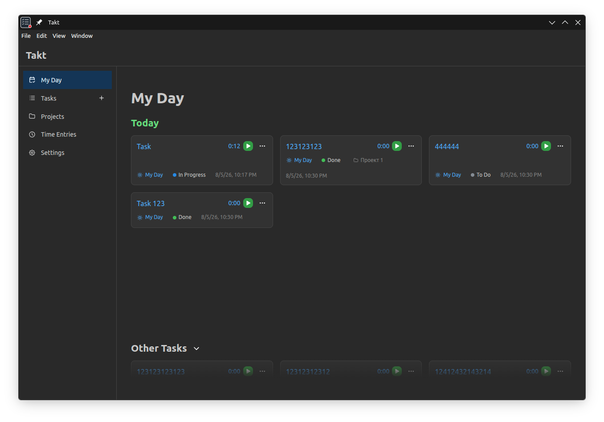
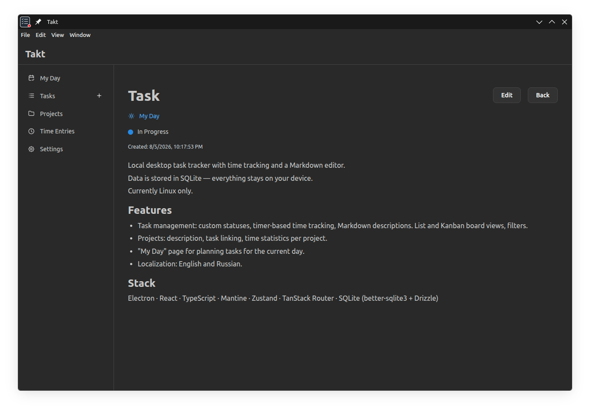

# Takt

[English](#takt) · [Русский](#takt-1)

Local desktop task tracker with time tracking and a Markdown editor.
Data is stored in SQLite — everything stays on your device.

Currently Linux only.

## Features

- Task management: custom statuses, timer-based time tracking, Markdown descriptions. List and Kanban board views, filters.
- Projects: description, task linking, time statistics per project.
- "My Day" page for planning tasks for the current day.
- Localization: English and Russian.

## Stack

Electron · React · TypeScript · Mantine · Zustand · TanStack Router · SQLite (better-sqlite3 + Drizzle)

## Screenshots

---

# Takt

Локальный десктоп-трекер задач с учётом времени и Markdown редактором.
Данные хранятся в SQLite, всё остаётся на вашем устройстве.

Пока поддерживается только Linux.

## Возможности

- Добавление задач, кастомные статусы, учёт времени с помощью таймера, описание в Markdown. Отображение в списке и канбан-доске, фильтры.
- Проекты: описание, привязка к задачам, статистика времени по проектам.
- Страница "Мой день", для планирования задач на текущий день.
- Локализация: русский и английский.

## Стек

Electron · React · TypeScript · Mantine · Zustand · TanStack Router · SQLite (better-sqlite3 + Drizzle)

## Скриншоты

